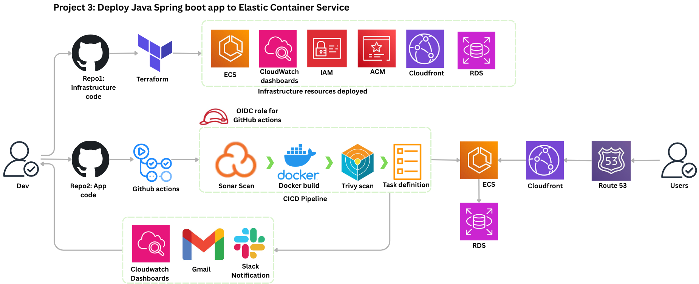

🚀 Project Overview – ECS Deployment with GitHub Actions

This project is part of a hands-on DevOps learning series designed to help junior DevOps engineers build real-world skills using cloud-native and container-based architectures.

In this project, we build a complete CI/CD pipeline that:

Builds a Java WAR application using Maven

Containerizes the application using Docker

Pushes the Docker image to Amazon Elastic Container Registry

Deploys the container to Amazon Elastic Container Service (ECS)

Uses GitHub Actions for automated CI/CD

Performs a basic health check after deployment

🧠 Learning Objectives

By completing this project, you will learn how to:

Containerize Java applications using Docker

Push images securely to Amazon ECR

Deploy containers to Amazon ECS (Fargate or EC2 launch type)

Configure ECS Task Definitions and Services

Use GitHub Actions for CI/CD pipelines

Authenticate GitHub Actions to AWS using IAM roles

Perform rolling deployments in ECS

Implement health checks in container-based environments

🏗️ Architecture

```

```
CI/CD Pipeline Architecture

Flow:

Developer pushes code to main branch

GitHub Actions pipeline triggers

Maven builds the WAR file

Docker image is built

Image is pushed to Amazon ECR

ECS Task Definition is updated

ECS Service performs rolling deployment

Application becomes available via Load Balancer

🔧 Technology Stack
Component	Version
OS	Ubuntu 22.04 (local dev)
Java	OpenJDK 17
Maven	3.x
Docker	Latest
Container Registry	Amazon ECR
Container Orchestration	Amazon ECS (Fargate)
CI/CD	GitHub Actions
Artifact Type	Docker Image
🌐 AWS Infrastructure Components

Amazon ECR Repository – Stores Docker images

Amazon ECS Cluster – Runs containers

ECS Task Definition – Defines container configuration

ECS Service – Manages running tasks

Application Load Balancer (ALB) – Routes traffic to ECS tasks

IAM Roles – Secure access between services

🚀 Deployment Workflow (GitHub Actions)

The CI/CD pipeline is defined using:

📄 .github/workflows/deploy.yml

🔄 Pipeline Stages
1️⃣ Checkout Code

Pulls code from the main branch

2️⃣ Build Application

Runs:

mvn clean package


Produces a WAR file

3️⃣ Build Docker Image

Builds container image

Tags image with:

latest

Git commit SHA

4️⃣ Authenticate to AWS

Uses GitHub Secrets:

AWS_ACCESS_KEY_ID

AWS_SECRET_ACCESS_KEY

AWS_REGION

Logs into Amazon ECR

5️⃣ Push Image to ECR

Pushes Docker image to:

<account-id>.dkr.ecr.<region>.amazonaws.com/app-name

6️⃣ Update ECS Task Definition

Replaces image URI with new tag

Registers new task definition revision

7️⃣ Deploy to ECS Service

Forces new deployment

ECS performs rolling update

Zero-downtime deployment

8️⃣ Health Check

Verifies:

ECS tasks are running

Target group health is healthy

Application returns HTTP 200

📦 Container Strategy

Instead of deploying a WAR file directly to Tomcat on EC2:

The application is packaged inside a Docker image

Tomcat runs inside the container

The container is deployed via ECS

This follows modern cloud-native best practices.

🔐 Permissions Model
IAM Roles Used

GitHub → AWS IAM User or OIDC Role

Push to ECR

Update ECS Task Definitions

Update ECS Service

ECS Task Execution Role

Pull images from ECR

Send logs to CloudWatch

This mirrors real-world secure CI/CD setups.

🧪 Health Check Logic

Health validation includes:

ECS task running status

ALB Target Group health check

HTTP check on application endpoint

Container logs in CloudWatch

🛠️ Common Troubleshooting
View ECS Service Events

ECS Console → Cluster → Service → Events

Check Running Tasks

ECS → Tasks → Logs (CloudWatch)

Verify Image in ECR

ECR → Repository → Images

Check ALB Health

EC2 → Target Groups → Target Health

🔄 Deployment Strategy

Deployment type: Rolling Update (ECS Default)

New task starts

Health check passes

Old task is terminated

No downtime

Future enhancements may include:

Blue/Green deployments (CodeDeploy + ECS)

Canary releases

Infrastructure as Code using Terraform

Migration to Kubernetes (EKS)

🎯 Target Audience

This project is ideal for:

Junior DevOps Engineers

DevOps learners & students

Engineers transitioning into cloud-native DevOps

Candidates preparing for AWS DevOps interviews

✅ Final Result

After a successful GitHub Actions pipeline run:

Docker image stored in Amazon ECR

ECS service updated automatically

Application available via Load Balancer:

http://<ALB-DNS-NAME>/

🚀 What You Learned Compared to EC2 Deployment
EC2 + Jenkins	ECS + GitHub Actions
VM-based	Container-based
Manual server management	Fully managed orchestration
Tomcat installed on EC2	Tomcat inside container
Jenkins on same VM	Cloud-native CI/CD
Port management required	ALB handles routing

This project transitions you from traditional VM-based deployments to modern containerized cloud-native DevOps practices using GitHub Actions and Amazon ECS.